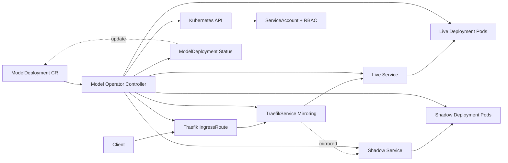

# Architecture

This document describes the high-level architecture of the `ModelDeployment` operator and request path.

## Component Diagram

## Reconciliation Flow

1. User applies a `ModelDeployment` custom resource.
2. Operator watch loop receives reconcile event.
3. Operator ensures finalizer is present.
4. Operator ensures live service + deployment exist.
5. If `spec.shadow` is set, operator ensures shadow service + deployment exist.
6. If `spec.trafficMirror` is `true`, operator ensures Traefik `TraefikService` and `IngressRoute`.
7. Operator reads child deployment statuses and computes CR status (`phase`, `conditions`, replica fields).
8. Operator patches status back to `ModelDeployment`.

## Request Routing Behavior

- Client traffic enters through Traefik `IngressRoute`.
- Primary response path is always the live deployment.
- Shadow receives mirrored traffic only when mirroring is enabled.
- Shadow responses are not returned to the client.
